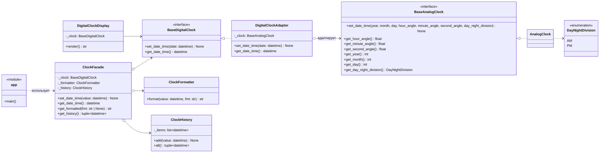

```mermaid
classDiagram
    direction LR

    class app {
        <<module>>
        +main()
    }

    class ClockFacade {
        -_clock: BaseDigitalClock
        -_formatter: ClockFormatter
        -_history: ClockHistory
        +set_date_time(value: datetime) None
        +get_date_time() datetime
        +get_formatted(fmt: str | None) str
        +get_history() tuple~datetime~
    }

    class BaseDigitalClock {
        <<interface>>
        +set_date_time(date: datetime) None
        +get_date_time() datetime
    }

    class DigitalClockAdapter {
        -_clock: BaseAnalogClock
        +set_date_time(date: datetime) None
        +get_date_time() datetime
    }

    class BaseAnalogClock {
        <<interface>>
        +set_date_time(year, month, day, hour_angle, minute_angle, second_angle, day_night_division) None
        +get_hour_angle() float
        +get_minute_angle() float
        +get_second_angle() float
        +get_year() int
        +get_month() int
        +get_day() int
        +get_day_night_division() DayNightDivision
    }

    class AnalogClock

    class DayNightDivision {
        <<enumeration>>
        AM
        PM
    }

    class ClockFormatter {
        +format(value: datetime, fmt: str) str
    }

    class ClockHistory {
        -_items: list~datetime~
        +add(value: datetime) None
        +all() tuple~datetime~
    }

    class DigitalClockDisplay {
        -_clock: BaseDigitalClock
        +render() str
    }

    app ..> ClockFacade : использует
    ClockFacade o--> BaseDigitalClock
    ClockFacade o--> ClockFormatter
    ClockFacade o--> ClockHistory

    BaseDigitalClock <|.. DigitalClockAdapter
    DigitalClockAdapter o--> BaseAnalogClock : адаптирует
    BaseAnalogClock <|.. AnalogClock
    AnalogClock ..> DayNightDivision

    DigitalClockDisplay --> BaseDigitalClock
```
